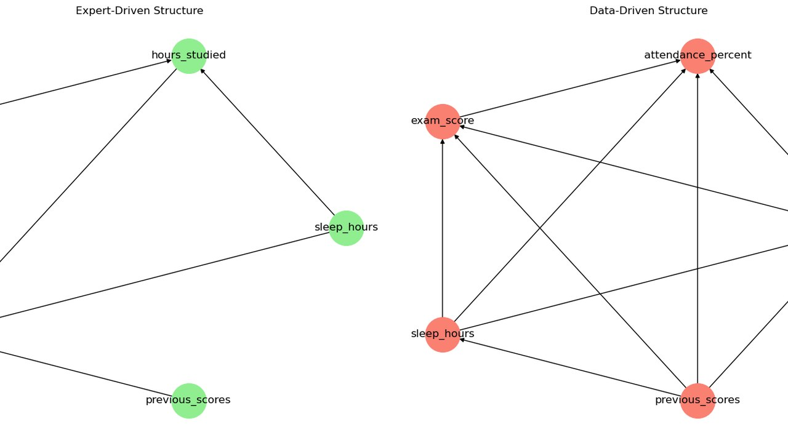

# Predicción académica con redes bayesianas

[](https://skillicons.dev)

Modelo probabilístico que predice la nota de un examen a partir de los hábitos del estudiante: horas de estudio, sueño, asistencia y notas previas.



## Qué hace

- Construye una red diseñada a mano con criterio experto y otra aprendida de los datos con Hill-Climbing.
- Compara ambas estructuras y cómo responden a la inferencia.
- Hace consultas probabilísticas y un análisis de sensibilidad para ver qué variables pesan más.

## Cómo ejecutarlo

```bash
pip install pgmpy pandas numpy matplotlib networkx seaborn jupyter
jupyter notebook FAIKR_M3_PROJECT_EnriqueSuch_DavidValls.ipynb
```

## Contenido

| Fichero | Qué es |
|---|---|
| `FAIKR_M3_PROJECT_EnriqueSuch_DavidValls.ipynb` | Notebook con todo el desarrollo |
| `REPORT_FAIKR_M3_PROJECT_EnriqueSuch_DavidValls.pdf` | Informe del proyecto |
| `Bayesian Network.pptx` | Presentación |
| `student_exam_scores.csv` | Dataset |

---

Proyecto en pareja de la asignatura FAIKR del Máster en Inteligencia Artificial, Università di Bologna (Erasmus+). Forma parte de mi [portfolio](https://quique-such.github.io/portafolio/).
